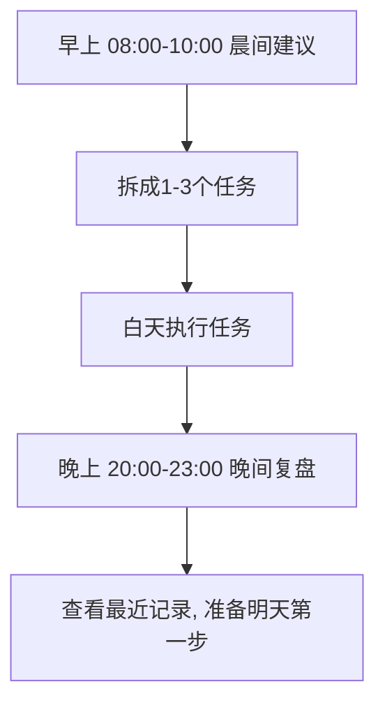

# LifePath AI 使用手册（图文版）

> 目标：**高中生也能看懂并直接上手**
>
> 一句话介绍：这是一个帮你「早上定行动、晚上做复盘」的小系统。

---

## 0. 你会得到什么？

每天只要做 3 件事：

1. 早上输入你最困扰的问题
2. 按建议做一个小任务（25 分钟）
3. 晚上复盘今天进展

系统会帮你保存记录，让你看见自己的连续进步。

---

## 1. 界面速览（示意图）

```text
┌──────────────────────────────────────────────┐
│ 仙人指路 · LifePath AI                        │
├──────────────────────────────────────────────┤
│ [新手引导] 1分钟看懂怎么用                     │
├──────────────────────────────────────────────┤
│ [晨间建议] 输入问题 -> 生成今天最优动作         │
├──────────────────────────────────────────────┤
│ [晚间复盘] 完成了什么/卡在哪/明天先做什么       │
├──────────────────────────────────────────────┤
│ [今日任务看板] 添加任务 / 勾选完成 / 删除        │
├──────────────────────────────────────────────┤
│ [最近记录] 脱敏展示 + 分页加载                  │
└──────────────────────────────────────────────┘
```

---

## 2. 新手流程（4 步）

### 第一步：注册/登录
- 输入邮箱 + 密码（至少 8 位）
- 成功后自动进入主界面

### 第二步：晨间建议（早上用）
- 在“今天最困扰的问题”写一句话
- 点「生成晨间建议」
- 系统会给你一个可以马上执行的小动作

✅ 示例：
- 问题：`我今天不知道先做什么`
- 结果：`先做一个25分钟、可完成、可验证的小动作...`

### 第三步：今日任务看板
- 把晨间建议拆成 1~3 个任务
- 完成就勾选，没用的可以删除

### 第四步：晚间复盘（晚上用）
- 填三个框：
  - 今天完成了什么
  - 主要卡点
  - 明早先做什么
- 点「生成晚间复盘」

---

## 3. 一天最佳使用节奏（推荐）



---

## 4. 常见问题（非常白话版）

### Q1：我应该一次写很多吗？
不用。一次写一句核心问题就够了。

### Q2：为什么强调 25 分钟？
因为短任务更容易开始。先完成，再优化。

### Q3：看板任务会不会丢？
不会（默认保存在浏览器本地 localStorage）。

### Q4：我输错了怎么办？
任务可删除；晨间/晚间可以重新提交。

---

## 5. API 说明（开发同学看）

## 5.1 鉴权
- 登录后得到 `token`
- 请求头：`Authorization: Bearer <token>`

## 5.2 主要接口
- `POST /api/auth/register`
- `POST /api/auth/login`
- `POST /api/advice/morning`
- `POST /api/advice/evening`
- `GET /api/advice/journal?limit=10&offset=0`

## 5.3 统一错误结构

```json
{
  "success": false,
  "error": {
    "code": "VALIDATION_ERROR",
    "message": "String should have at least 1 character"
  }
}
```

---

## 6. 本地运行（最短路径）

### 后端
```bash
cd backend
pip install -r requirements.txt
uvicorn app.main:app --reload --port 8000
```

### 前端
```bash
cd frontend
npm install
npm run dev
```

访问：`http://localhost:5173`

---

## 7. OpenAPI 文档入口

启动后端后可访问：
- Swagger UI: `http://localhost:8000/docs`
- ReDoc: `http://localhost:8000/redoc`

接口里已加了中文 `summary/description` 和请求 `examples`，便于对照测试。

---

## 8. 给运营/产品的演示话术（30秒）

> 这是一个“行动力增强器”。
> 早上帮你把焦虑变成一个可执行动作，
> 白天用任务看板推进，
> 晚上自动复盘沉淀，
> 形成持续进步闭环。
